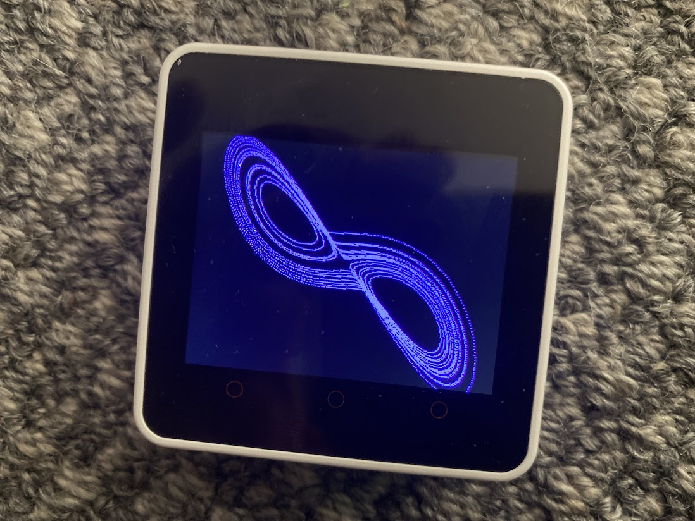
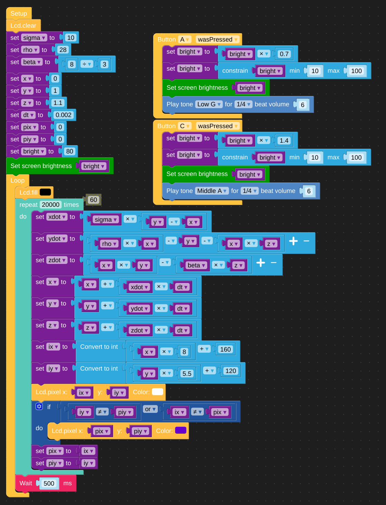

# lorenzcore
Lorenz Attractor on a M5Stack Core2

A quick and dirty UIFlow program to plot the X and Y values of a Lorenz attractor in "real time". Change brightness with A and C buttons.

Also included in this repo is an Arduino IDE version. Cycle through brightess with BtnC. Updated for M5Unified. Not updated for M5StickC.

